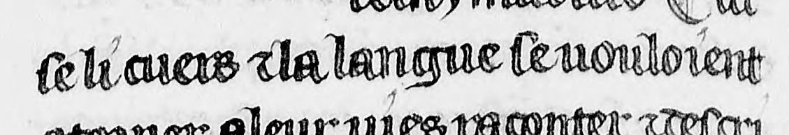

Normes de transcription
====

# Mise en pages
## Paragraphes
Les paragraphes sont soigneusement marqués dans le manuscrit par des pieds de mouche dorés sur fonds alternativement rouges et bleus. Ils ont été transcrits par le caractère ¶ (cf. [issue 13](https://github.com/kristinkonstantinova/TNAH-2021-DecameronFR/issues/13)).

## Annotations marginales
Comme le montre l'image ci-dessus, des manchettes figurent parfois en marge pour indiquer le sujet d'un passage significatif. Elles n'apparaissent pas dans le manuscrit de la Bibliothèque vaticane (Pal. lat. 1989) dont Arsenal 5070 est un *codex descriptus* et semblent donc être l'oeuvre de notre copiste (cf. [issue 21](https://github.com/kristinkonstantinova/TNAH-2021-DecameronFR/issues/21)).

# Règles de transcription
## *i/j* et *u/v*
A l'intérieur des mots, les lettres *i* et *j* ainsi que les lettres *u* et *v* ne sont pas graphiquement distinctes, comme ici dans le cas de *tousjours* et de *toutesvoies* :

 

De même, en position initiale, les caractères ayant valeur de *i* ou *j* suivent le même *ductus*, comme ici avec *jugement* et *illec* :

 

Les caractères ayant valeur de *u* ou de *v* suivent eux aussi le même *ductus* en position initiale, comme ici avec *vous* et *une* :

 

Des choix distincts se manifestent dans le corpus d'entraînement du projet Cremma-Médiéval, et ce bien que le [readme](https://github.com/HTR-United/cremma-medieval#readme) précise : "*u/v or i/j are not distinguished*".

1. BnF, fr. 411, *Vie de saint Lambert* : les lettres ayant valeur de *u* ou de *v* présentent toujours le même *ductus* dans le manuscrit, en position initiale ou à l'intérieur des mots, mais ils sont parfois transcrits *v* en début de mot :

    
    Transcrit :
    > se li cuers ⁊ la langue se vouloient
    
    Dans la plupart des cas où *u* a valeur de *v*, ils ont été transcrits par un *u*.

2. BnF, fr. 844, *Manuscrit du Roi* : en position initiale les lettres ayant valeur de *u* ou de *v* prennent la forme d'un *v* ; ce choix graphique a été respecté dans la transcription :

    
    Transcrit :
    > quant en tel lieu vout mon cuer em¬

Nous avons fait le choix de ne distinguer *i/j* et *u/v* ni selon leur valeur, ni selon leur forme. Reprenant les exemples d'Arsenal 5070 cités plus haut, ils ont été transcrits : 
> iugement - illec - uous - une

   

La limite de ce choix de ne pas distinguer *i/j* et *u/v* est certes de rendre impropre nos données à l'étude de l'apparition des lettres *v* et *j* dans les manuscrits médiévaux.

Ce choix a en revanche pour avantage sa simplicité de conception et d'application, et reste en cohérence avec le système graphique du manuscrit dans la mesure où il ne l'affecte que sur les caractères initiaux et sans en interpréter la valeur phonétique, ménageant ainsi la possibilité d'une évolution des critères et d'une modification en masse.

## Allographes
Inégalement retenue dans le corpus d'entraînement du Cremma-Médiéval, la distinction des *s* longs et des *s* ronds a été retenue dans notre transcription.

Outre la stabilité des choix scribaux concernant l'emploi de ces allographes sur la longue durée, les problèmes engendrés par l'indistinction des formes de *s* sont de nature à conforter cette décision. En effet, l'entraînement du modèle HTR a permis de constater de très nombreuses confusions entre  *ſ* et *l*, dont résulte la transcription de nombreux *l* en *s*.

Cf. [issue 11](https://github.com/kristinkonstantinova/TNAH-2021-DecameronFR/issues/11#issuecomment-977986556) et [issue 17](https://github.com/kristinkonstantinova/TNAH-2021-DecameronFR/issues/17).

## Majuscules et minuscules
Les noms propres ne prennent pas de majuscule dans le manuscrit (par exemple *Florence*, f2vb) :

L'emploi des majuscules est en revanche systématique comme élément de structuration du texte par le scribe :
- Toujours après un pied de mouche ;
- Toujours après une pause forte (point médian notamment) ;
- Et dans quelques cas plus complexes, dont un exemple détaillé est exposé ci-après.

Le mot *et* peut ainsi prendre une majuscule, non seulement après un pied de mouche ou une pause forte, mais aussi après une pause faible (de type virgule).

Voici comment le *et* change de valeur graphique en fonction de sa valeur syntaxique, à partir de deux exemples présentant la même ponctuation avant le *et* (la pause faible de type virgule) :

1. Avec *et rire* dans l'exemple suivant, *et* prend une minuscule initiale car il s'agit d'une énumération :

    

    Transcription interprétative :
    > soy soulachier et obeir a l'appetit en toute chose possible, et rire de tous cas survenans…

2. En revanche, avec *et ceste chose* dans l'exemple suivant, on est dans le cas d'une locution prépositive ; dans une édition interprétative on ferait précéder *et ceste chose* d'un point marquant la fin de la phrase précédente et *et* prendrait une majuscule, à l'image du choix graphique du scribe :

    

    Transcription interprétative :
    > …taverne, maintenant en une autre sans compte et sans mesure. Et ceste chose ilz faisoient moult plus…

La forme du *e* initial n'étant pas toujours celle-ci (l'exemple précédant le montre avec *et sans mesure*), nous avons bien affaire à des *e* majuscules dans le cas où *et* a la fonction de locution de sens équivalent à *de plus*, *en outre*, etc.

Ce choix de la majuscule se produit dans les mêmes conditions avec le *c* de la locution *c'est assavoir* (f2v).

On a par conséquent transcrit en majuscule :
- Toutes les lettres placées après un pied de mouche ;
- Toutes les lettres placées après une pause forte ;
- Les majuscules employées par le scribe dans le cas étudié ici, où l'usage graphique rejoint la fonction syntaxique de la locution, même après une pause faible de type virgule (ou même en l'absence de toute ponctuation comme on l'indique *infra*).

Cf. [issue 11](https://github.com/kristinkonstantinova/TNAH-2021-DecameronFR/issues/11#issuecomment-981415832).

## Séparation des mots
Le texte présente une séparation des mots claire, que nous avons suivie.

L'usage graphique du scribe a également été respecté en ne découpant pas les articles ou prépositions élidés devant un mot, et en ne restituant pas d'apostrophe.

On a donc transcrit *louuraige* et non *l'ouuraige* dans le cas suivant :

Ou encore, *quilz nentrassent* et non *qu'ilz n'entrassent* :

## Abréviations
Les abréviations n'ont pas été résolues. Il a été fait appel à des caractères MUFI dans les cas les plus simples (cf. caracteres.html).

Pour les abréviations n'ayant pas de caractère dédié, l'apostrophe (`&#39;`) n'étant ni employée par le scribe ni restituée, a été utilisée comme signe abréviatif générique :

Transcription interprétative :
> tres pou de gens mortes estoient

A été transcrit :
> treſpou de gens mortes est'

Transcription interprétative :
> Envers

A été transcrit :
> Enu's

## Accentuation et lettres pointées
En l'absence d'accentuation dans le manuscrit, aucun caractère accentué n'a été employé dans la transcription.

Les *i* et les *y* sont souvent pointés dans le manuscrit, mais pas systématiquement.
- *Comprinse* avec *i* pointé :

    

- *Sentier* avec *i* non pointé :

    

Le pointage étant un élément graphique minime, il a été choisi de ne pas en tenir compte (ni pour *i* ni pour *y*) dans la perspective de l'entraînement de modèles HTR. En outre, en l'absence de règle évidente suivie par le copiste, il a été jugé préférable de moderniser la transcription des *i* en utilisant partout le caractère moderne pointé, comme dans le corpus du Cremma-Médiéval.

## Ponctuation
Le texte du témoin manuscrit a été soigneusement ponctué. Ces signes ont été transcrits par des caractères conventionnels et des caractères spéciaux MUFI (cf. caracteres.html) :
- Pause forte : 
    - Point médian : MUFI MIDDLE DOT ;
    - *Punctus elevatus*, ancêtre du point virgule d'emploi rare dans notre manuscrit, a été transcrit dans le corpus du Cremma-Médiéval par un simple point virgule moderne ; nous avons repris cette solution ;
- Pause faible : transcrit par une simple virgule ;
- Trait de suite : transcrit par un simple trait d'union.

La ponctuation est très souvent présente avant la conjonction *Et* dotée d'une majuscule, celle-ci ayant une forte valeur syntaxique. Mais elle est parfois absente :

## Corrections
Le texte présente quelques corrections, comme ici :

Par mesure de simplicité, plutôt que d'utiliser des caractères MUFI pour les lettres exponctuées (par exemple ẹ - 1EB9) il n'en a pas été tenu compte dans la transcription :

> auant et ne auoit

Cf. [issue 11](https://github.com/kristinkonstantinova/TNAH-2021-DecameronFR/issues/11#issuecomment-998959561).

## Nombres
En accord avec la pratique du scribe, les nombres ont été transcrits suivis d'un point médians :

Transcription :
> iii· ou iiii·