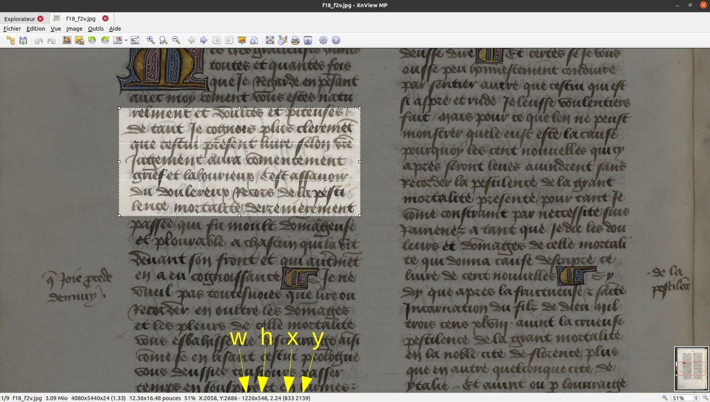

Tuto IIIF
====

Comment partager une *région d'intérêt* dans une image IIIF ?

# Identifier les coordonnées en pixels de la région d'intérêt
Cette opération est facile avec le logiciel libre **XnView MP**, télachargeable [ici](https://www.xnview.com/fr/xnviewmp/#downloads).
Une fois la sélection de la région effectuée, les coordonnées s'inscrivent en bas de la fenêtre.
Il faut noter :
- `x` : la position du coin supérieur gauche de la sélection sur l'axe horizontal
- `y` : la position du coin supérieur gauche de la sélection sur l'axe vertical
- `w` (pour *width*) : la largeur de la sélection
- `h` (pour *height*) : la hauteur de la sélection



# Créer l'URL de la région d'intérêt
- Importer le script Python3 `py/iiifSelection.py`
- Ouvrir un terminal à l'emplacement du script et entrer la commande :
```shell
$ python3 iiifSelection.py [paramètre URL] [paramètre ark] [paramètre nom de l'image] [paramètre x] [paramètre y] [paramètre w] [paramètre h]
```
- Détail des paramètres indiqués :
    + `paramètre URL` : le site où l'image est hébergée, par exemple `https://gallica.bnf.fr` (un alias a été créé pour Gallica, il suffit de donner comme paramètre `gallica`)
    + `paramètre ark` : le numéro ark de l'objet, par exemple, pour le manuscrit Paris, Arsenal 5070 contenant notre traduction du *Decameron* : `ark:/12148/btv1b7100018t` (un alias a été créé pour lui, il suffit de donner comme paramètre `decars`, en référence à "Decameron-Arsenal")
    + `paramètre nom de l'image` : le numéro du fichier image attribué par Gallica, sous la forme `f+NOMBRE`
    + `paramètres x, y, w, h` : les coordonnées de la région en pixels
- Pour l'exemple montré ci-dessus, la commande sera donc :
```shell
$ python3 iiifSelection.py gallica decars f18 833 2139 1226 548
```
- Tester l'URL obtenue : https://gallica.bnf.fr/iiif/ark:/12148/btv1b7100018t/f18/833,2139,1226,548/max/0/default.jpg


Pour aller plus loin, voir la [documentation de l'API Image IIIF](https://iiif.io/api/image/3.0/#41-region).